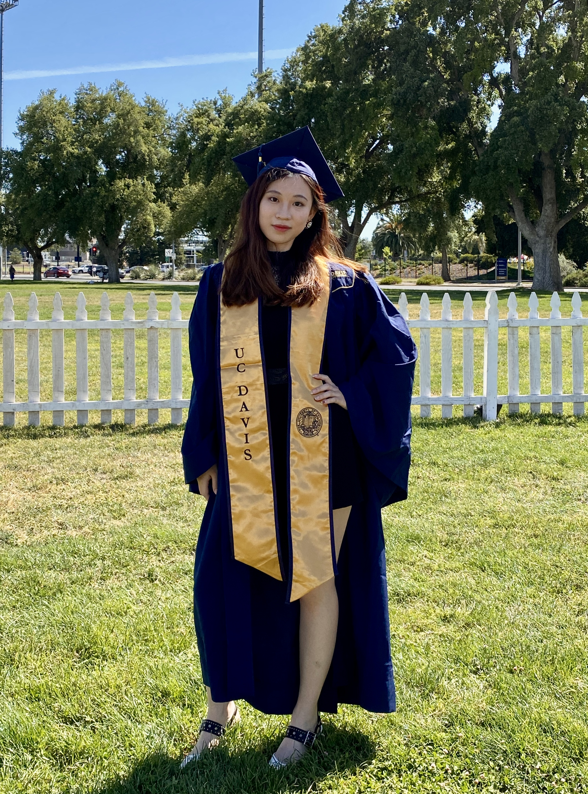

  
  <h1 class="mt-3"><strong>Nianlin (Cassie) Chen</strong></h1>
  

    Bayesian Inference · High-dimensional Data Analysis · Statistical Genetics (GWAS) · Clinical Trials · Machine Learning
  

---

## Contact

- **Email:** <a href="mailto:chennianlin26@163.com">chennianlin26@163.com</a>  
- **Phone:** +1 (530) 220-4570  

---

## Professional Memberships  

Student Member, **American Statistical Association (ASA)**  
- Statistical Genetics and Genomics Section  
- Biometrics Section  
- Statistical Learning and Data Science Section  

---

## Research Interests  

- Bayesian hierarchical modeling & MCMC/HMC  
- High-dimensional data analysis & PCA  
- Statistical genetics & GWAS
- Adaptive & platform clinical-trial design 
- Machine learning & deep learning for biomedical data  

---

## Highlighted Projects  

<ul class="project-menu">
  <li><a href="./projects/bootstrap.html">Bootstrap PCA</a></li>
  <li><a href="./projects/music.html">Music Genre Classification</a></li>
  <li><a href="./projects/dpca.html">Demixed PCA (R package)</a></li>
  <li><a href="./projects/hmc.html">Bayesian Forecasting (Walmart)</a></li>
  <li><a href="projects/">See all projects →</a></li>
</ul>